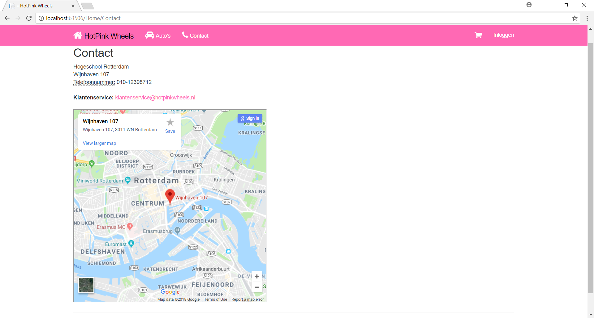
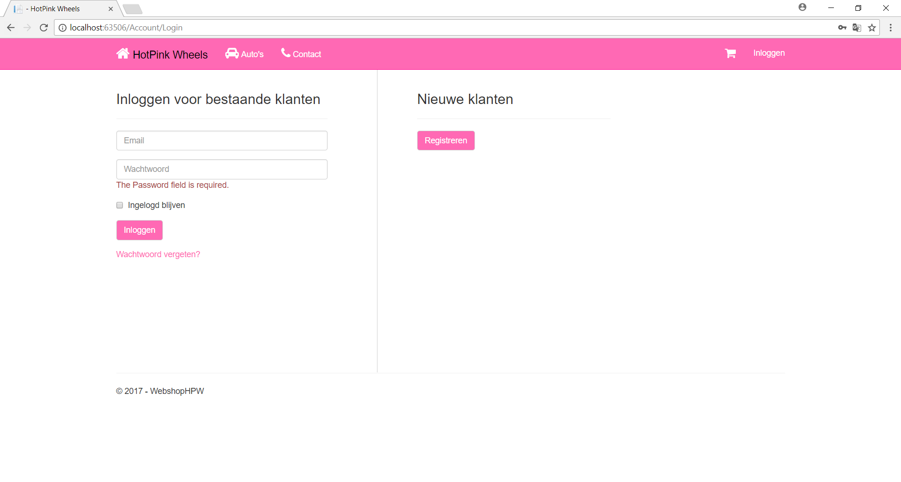
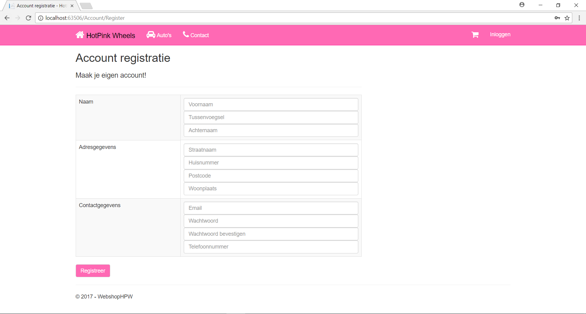
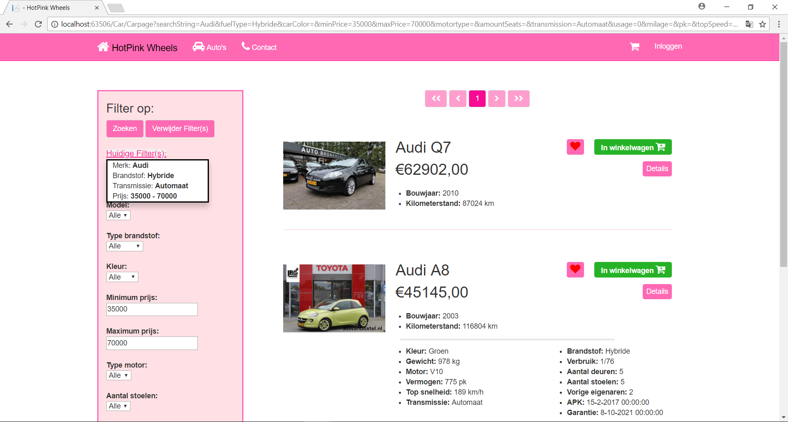

## HotPink Wheels
A webshop which sells second-hand cars. The website was designed based on the MVC design pattern, using C#, a Razor template and Javascript. The webshop is supported by a Postgres database. Sensitive user information such as passwords is hashed. The webshop uses SendGrid to send emails. A PayPal sandbox is in place to simulate real payments.

## Screenshots

<table><tr><td>
 
</td></tr>
<tr><td>The initial landing page when accessing the website.</td></tr>
</table>

<table><tr><td>
 
</td></tr>
<tr><td>The page with all the contact details.</td></tr>
</table>

<table><tr><td>

</td><td>

</td></tr>
<tr><td>The login and register page</td></tr>
</table>

<table><tr>

</tr>
<tr><td>

</td><td>

</td></tr>
<tr>A page with all listed cars along with a filter functionality.</tr>
</table>

