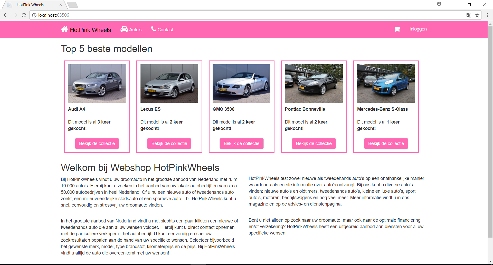
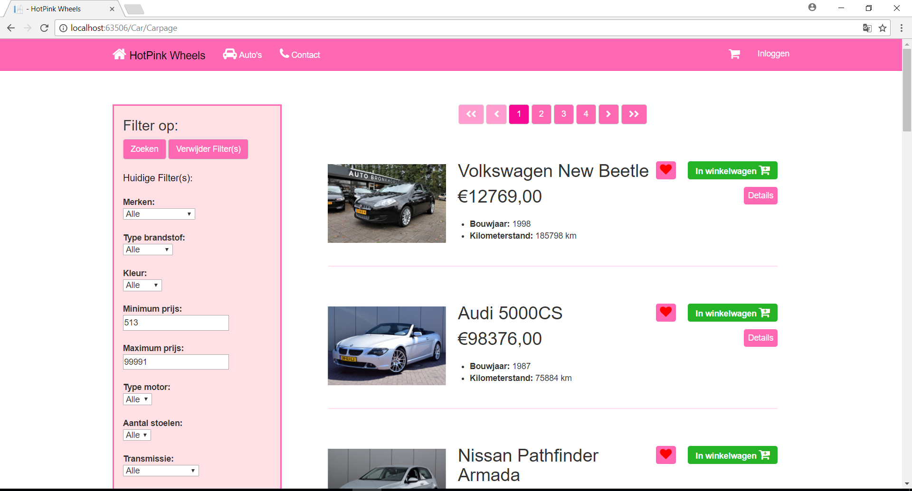
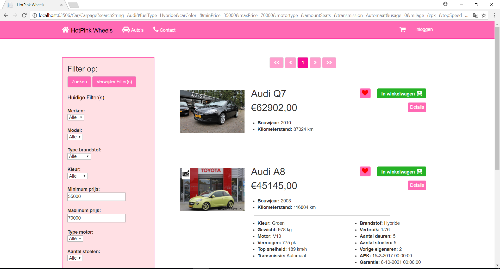

## HotPink Wheels
A webshop which sells second-hand cars. The website was designed based on the MVC design pattern, using C#, a Razor template and Javascript. The webshop is supported by a Postgres database. Sensitive user information such as passwords is hashed. The webshop uses SendGrid to send emails. A PayPal sandbox is in place to simulate real payments.

## Screenshots

